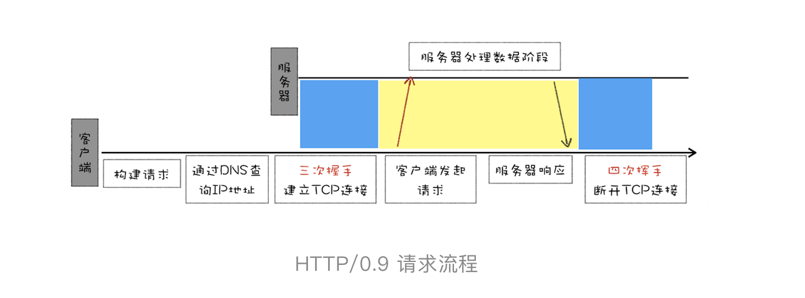
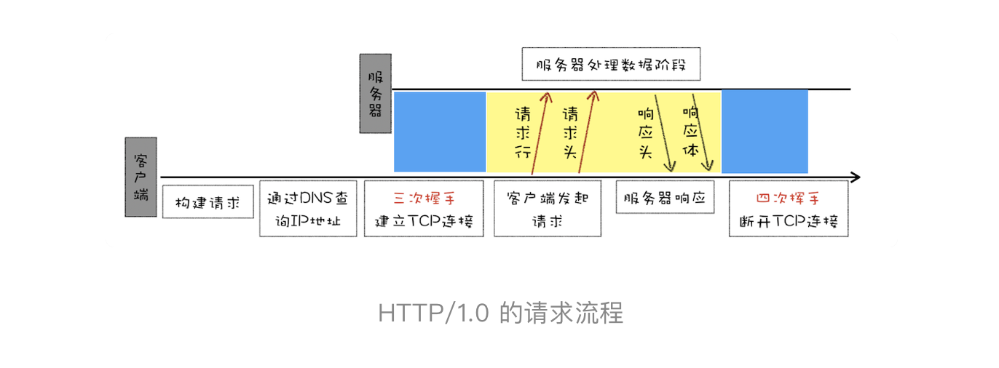
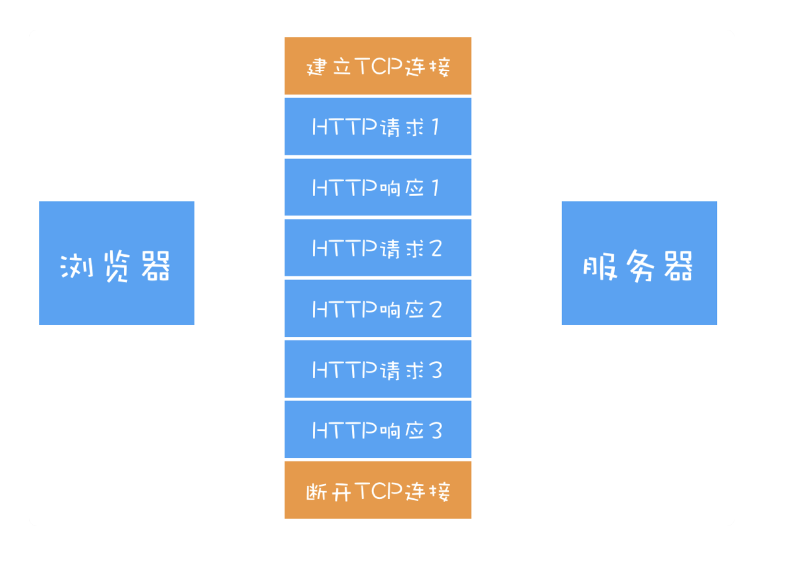
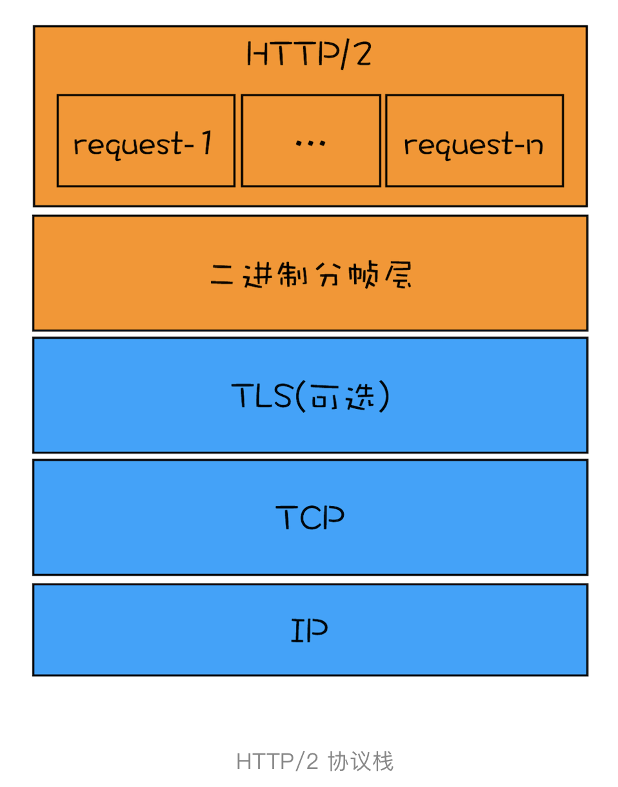
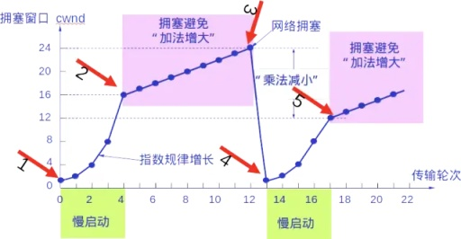

## 超文本传输协议 HTTP
### 0.9
早期定义， 无 header 投， response 头， 客户端 GET / a.html , 服务端返回 ASCII 字符流。

### 1.0
主要解决完善协议，支持多种文件类型问题。 引入 http 头。 accept encoding Charset 状态码  Cache。

### 1.1 
+ 解决传输性能问题， 同个域名支持多个 TCP 长连接， TCP 长连接保持（Connection）
+ 客户端 Cookoe， 安全机制
存在队头阻塞问题

### 2.0
解决队头阻塞问题
多路复用

## TCP
### 三次握手 四次挥手
Syc Seq ACK

### 滑动窗口控制
所谓窗口，表示的是发送端无需等待确认应答而可以连续发送的多段数据区域。

### 重发控制
发送端发送完数据，并未收到接收端的确认应答，为丢包。
1. 网络抖动原因，发送给接收端的数据包丢失。 可能触发快速重传。
2. 应答包丢失。

### 拥塞机制
接收方维护 rwmd 标识自己的接收能力
发送发维护 cwnd(congestion window), 基本单位为最大报文段MSS。慢启动->拥塞避免->快恢复

